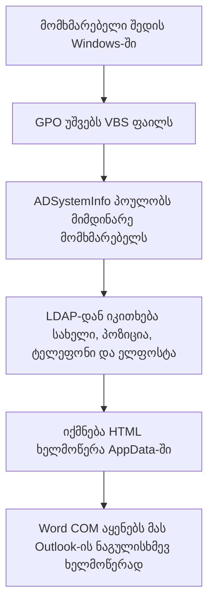

# Outlook-ის კორპორაციული ხელმოწერა VBScript-ით

ეს repository შეიცავს ქართულ სახელმძღვანელოსა და სამუშაო VBScript-ის ნიმუშს, რომელიც:

- მიმდინარე მომხმარებლის მონაცემებს იღებს **Active Directory-დან**;
- ქმნის პერსონალიზებულ HTML ხელმოწერას;
- ინახავს მას Outlook-ის Signatures საქაღალდეში;
- ხელმოწერას აყენებს ახალ წერილებსა და პასუხებზე;
- შესაძლებელია გავრცელდეს **Group Policy Logon Script**-ით.


## მნიშვნელოვანი შეზღუდვები

ეს გადაწყვეტა გათვლილია **Classic Outlook for Windows**-ზე. ის არ არის უნივერსალური გამოსავალი New Outlook-ისთვის, Outlook Web-ისთვის, macOS-ისთვის ან მობილური აპებისთვის.

საჭიროა:

- Windows domain გარემო და მომხმარებლის კავშირი local Active Directory-სთან;
- Microsoft Word/Classic Outlook-ის desktop კომპონენტები;
- AD-ში შევსებული შესაბამისი ატრიბუტები;
- ხელმოწერის გარე სურათებისთვის კლიენტის ინტერნეტწვდომა.

Microsoft ეტაპობრივად აუქმებს VBScript-ს, ამიტომ ეს მიდგომა უნდა ჩაითვალოს legacy გადაწყვეტად და არა გრძელვადიან არქიტექტურად.

## Repository-ის სტრუქტურა

```text
.
├── README.md
├── docs/
│   └── ito-ge-post.md
└── scripts/
    └── create-outlook-signature.vbs
```

- [VBScript](scripts/create-outlook-signature.vbs) — კონფიგურირებადი სამუშაო ნიმუში.
- [ito.ge-ის პოსტის ტექსტი](docs/ito-ge-post.md) — საიტზე გამოსაქვეყნებლად მომზადებული ქართული ვერსია.

## როგორ მუშაობს



სკრიპტი ინფორმაციას კითხულობს შემდეგი AD ატრიბუტებიდან:

| ხელმოწერის ველი | Active Directory ატრიბუტი |
|---|---|
| სახელი და გვარი | `displayName` |
| პოზიცია | `title` |
| კომპანია | `company` |
| ელფოსტა | `mail` |
| სამუშაო ტელეფონი | `telephoneNumber` |
| მობილური | `mobile` |
| ანგარიშის სახელი | `sAMAccountName` |

## მომზადება

1. გახსენით [create-outlook-signature.vbs](scripts/create-outlook-signature.vbs).
2. შეცვალეთ `COMPANY_WEBSITE`, `COMPANY_ADDRESS`, `COMPANY_LOGO_URL` და `ACCENT_COLOR`.
3. დარწმუნდით, რომ ლოგოს URL ხელმისაწვდომია HTTPS-ით და ავტორიზაციას არ ითხოვს.
4. AD Users and Computers-ში გადაამოწმეთ თანამშრომლის საჭირო ატრიბუტები.
5. ჯერ გაუშვით ერთ სატესტო კომპიუტერზე:

```bat
cscript.exe //nologo create-outlook-signature.vbs
```

6. გახსენით Classic Outlook → **File → Options → Mail → Signatures** და გადაამოწმეთ შედეგი.
7. სატესტო წერილი გაგზავნეთ Outlook-ის გარეთაც, რათა HTML-ისა და სურათის ჩვენება შეამოწმოთ.

## გავრცელება Group Policy-ით

1. გახსენით `gpmc.msc`.
2. შექმენით ან შეცვალეთ შესაბამის OU-ზე მიბმული GPO.
3. გადადით: **User Configuration → Policies → Windows Settings → Scripts (Logon/Logoff)**.
4. გახსენით **Logon → Add → Browse**.
5. განათავსეთ VBS ფაილი GPO-ს scripts საქაღალდეში და აირჩიეთ.
6. სატესტო OU-ზე შეამოწმეთ `gpupdate /force`-ისა და ხელახალი sign-in-ის შემდეგ.
7. მხოლოდ წარმატებული ტესტირების შემდეგ მიაბით პოლიტიკა ფართო OU-ს.

## უსაფრთხოებისა და ექსპლუატაციის შენიშვნები

- სკრიპტში პაროლები, API key-ები ან სხვა საიდუმლოებები არ შეინახოთ.
- AD-დან მიღებული ტექსტი HTML-encode ხდება, რათა სპეციალურმა სიმბოლოებმა markup არ დააზიანოს.
- გარე ლოგო წერილში embedded არ არის; მიმღების mail client-მა შეიძლება მისი ავტომატური ჩამოტვირთვა დაბლოკოს.
- მომხმარებელს ხელმოწერის შეცვლა ან წაშლა შეუძლია.
- ცვლილება მომხმარებელთან მხოლოდ სკრიპტის ხელახლა გაშვების შემდეგ აისახება.
- ჯერ გამოიყენეთ სატესტო OU და შეცდომების შემთხვევაში შეამოწმეთ Event Viewer, GPO Result და AD ატრიბუტები.

## წყარო და ავტორობა

სახელმძღვანელო დამოუკიდებლად არის შედგენილი CodeTwo-ს სტატიის ტექნიკური მიდგომის საფუძველზე:

- [VBScript: create an HTML Outlook email signature for the whole company](https://www.codetwo.com/admins-blog/vbscript-create-an-html-outlook-email-signature-for-the-whole-company/)

ორიგინალური სტატია და მისი მაგალითები ეკუთვნის CodeTwo-ს. ამ repository-ში არსებული ქართული ტექსტი და სკრიპტი წარმოადგენს დამოუკიდებელ, გამარტივებულ პრაქტიკულ იმპლემენტაციას.
